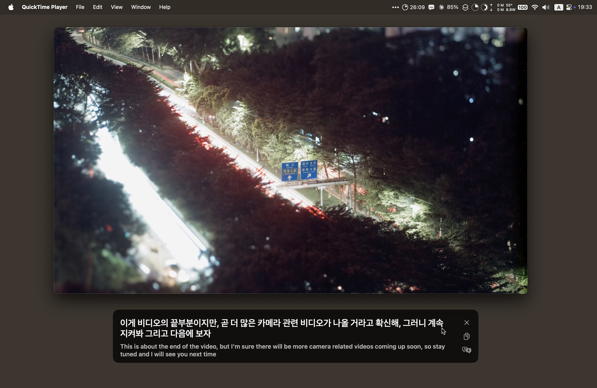

# Parakeet

Live captions for everything your Mac plays: videos, calls, podcasts. Korean,
Japanese, English and about 30 more languages, detected on their own. Speech
recognition runs entirely on your Mac's Neural Engine, and captions can be
translated into about 20 languages, on your Mac too; no audio or text
leaves it.

**[Download](https://github.com/LPFchan/Parakeet/releases/latest/download/Parakeet.dmg)** · Apple silicon, macOS 15+



## Using it

- Captions appear in a floating box whenever something speaks. Drag it
  anywhere; it remembers where. New words type in and scroll up line by line.
  Hovering over it shows buttons to turn captions off, copy the transcript,
  and pick a language to translate into.
- With a language picked, the translation shows large and the original
  small underneath. That language is taken as your own: while the audio is
  in it, the box stays hidden. macOS asks once to download each language it
  needs.
- The menu bar icon has a Captions on/off switch (⌘L), Copy Transcript,
  Translate To, Open at Login and Check for Updates. It checks for updates on every launch
  (and daily while running) and offers to install them.
- The same switch works from a terminal:

  ```sh
  alias parakeet=/Applications/Parakeet.app/Contents/MacOS/Parakeet
  parakeet status
  parakeet captions on|off
  ```

The app isn't notarized by Apple, so the first launch needs System Settings →
Privacy & Security → **Open Anyway**. A welcome window then asks for the
audio permission and downloads the speech model (~640 MB) from Hugging Face.

## How it works

- `SystemAudioTap.swift` captures all system audio with a Core Audio process
  tap and converts it to 16 kHz mono. It's rebuilt whenever the output device
  changes (headphones in or out), and it doesn't keep the Mac from sleeping.
- `NemotronEngine.swift` streams it through NVIDIA
  [Nemotron 3.5 ASR](https://huggingface.co/nvidia/nemotron-3.5-asr-streaming-0.6b)
  (via [FluidAudio](https://github.com/FluidInference/FluidAudio)'s Core ML
  build). Each 0.56 s of sound is processed once and words are never
  rewritten, so it uses ~10% of one CPU core. For the same reason a sentence
  locks in as soon as its full stop appears; one that runs on locks at a
  comma (~3 s) or any word (~5 s). When nothing is playing, the model isn't
  run at all.
  Measured on an M2 with [macmon](https://github.com/vladkens/macmon): the
  speech model draws about 0.12 W while captioning (~40 mW CPU, ~80 mW
  Neural Engine), and Parakeet idles at ~1 mW when nothing is playing.
- `CaptionPanel.swift` draws the captions. Only a scroll offset is animated;
  animating the text itself cost ~90% CPU. Its `Translator` hands locked text
  to Apple's Translation framework, naming the source language itself
  (`NaturalLanguage` detects it) so macOS doesn't stop to ask. Pieces of an
  unfinished sentence are re-translated together, shown dim until it ends.

## Development

```sh
scripts/build-app.sh          # → build/Parakeet.app
open build/Parakeet.app
build/Parakeet.app/Contents/MacOS/Parakeet --bench clip.wav   # 16 kHz float32 WAV
```

The interface is translated into the 28 languages Parakeet can caption, besides
English. Translations live in `app/Resources/Localizable.xcstrings` (and
`InfoPlist.xcstrings` for the permission prompt); Xcode can edit them, and
`scripts/build-app.sh` compiles them into the app. Try one with
`open build/Parakeet.app --args -AppleLanguages "(ko)"`.

`--bench` plays a clip into the engine in real time and prints the captions
and the CPU used. `open build/Parakeet.app --args --rehearse-first-launch`
opens the welcome window as a new user sees it, with a fake model download
and preparation pause, without touching the downloaded model. `swift scripts/make-icon.swift` redraws the app icon.

### Releasing

```sh
git tag v1.2.0 && git push origin v1.2.0
```

`.github/workflows/release.yml` then builds and signs the app, packs it into
`Parakeet.dmg` (`scripts/make-dmg.sh`: [DMGMaker](https://github.com/saihgupr/DMGMaker)
with the background from `Packaging/dmg-background.html`; re-render it with
`scripts/make-dmg-background.sh`), publishes a GitHub release, and adds it to
`docs/appcast.xml`, the
[Sparkle](https://sparkle-project.org) update feed served by GitHub Pages at
`parakeet.lost.plus` (a DNS-only Cloudflare CNAME to `lpfchan.github.io`, so
GitHub can issue its HTTPS certificate; the feed URL doesn't depend on the
repo's name). The site root just redirects here. Keep the repo name
lowercase, though: 1.0.0–1.1.1 read their feed from
`lpfchan.github.io/parakeet/appcast.xml`, which GitHub only redirects to
`parakeet.lost.plus` while the name matches exactly (Pages paths are
case-sensitive).
Version = the tag; build number = commit count.

It needs three repository secrets:

- `SPARKLE_PRIVATE_KEY`: signs updates; the app only installs updates signed
  with it. Its public half is `SUPublicEDKey` in `scripts/build-app.sh`.
- `SIGNING_CERT_P12`, `SIGNING_CERT_PASSWORD`: the "Parakeet Self-Signed"
  code-signing certificate (base64 .p12). It isn't trusted by Gatekeeper, but
  keeping the same one means macOS remembers the audio permission across
  updates.

GitHub can't show secrets again; backups live in passage (folder `sparkle`)
and in the maintainer's login keychain. Losing the Sparkle key means existing
installs can never update again.

## Credits

[FluidAudio](https://github.com/FluidInference/FluidAudio) (Apache-2.0),
[Sparkle](https://github.com/sparkle-project/Sparkle) (MIT), and NVIDIA's
Nemotron 3.5 ASR model ([OpenMDW-1.1](https://openmdw.ai/license/1-1/)),
downloaded at first launch. Parakeet itself is MIT-licensed. The license
notices ship inside the app, in `Contents/Resources/Licenses`.
